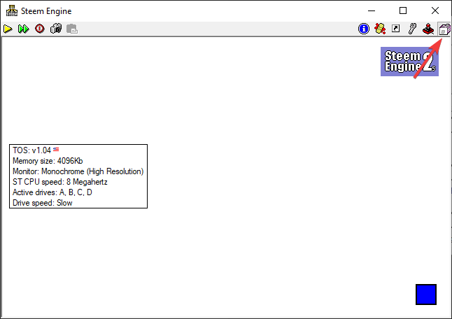

Instructons on how to run on a Windows 10 machine

Download the Steem emulator by googling "steem_student". Contact me if you're unable to locate this file.

Install the application.

After executing the application click the top right button called disk manager

After selecting disk manager, click hard drives

In the hard drive menu, put the path of the src folder in the pointed field

Hit the red circle on the top menu and when the D drive window pops up it should show the src folder

Double click on gu

In gu type the command 
`cd d:\aerfunk\src\`

Then type in 
`aero funk`
